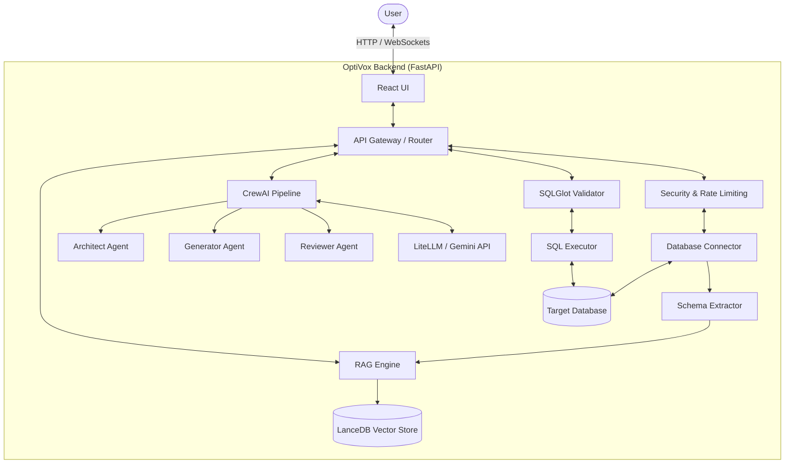

<div align="center">
  

  # OptiVox DB — Agentic AI SQL Studio

  **Transforming Database Interactions with CrewAI, LiteLLM, and LanceDB**

  [](#)
  [](#)
  [](#)
  [](#)
  [](#)

  <p>
    An intelligent, autonomous platform that translates natural language to executable SQL, provides deep schema analysis, teaches database concepts, and optimizes queries.
  </p>
</div>

---

## ✨ Key Features

- **🧠 Agentic SQL Generation (CrewAI)**: A multi-agent hierarchical crew (Architect → Generator → Reviewer) autonomously drafts, refines, and validates complex SQL queries from natural language.
- **📚 RAG Schema Search (LanceDB)**: Automatically extracts your database schema, generates embeddings using `sentence-transformers`, and injects relevant context into the LLM prompt for highly accurate, hallucination-free SQL.
- **🛠️ ADIA (Agentic Database Intelligent Assistant)**:
  - **Natural Language to SQL**: Converts plain-English questions to database-specific queries.
  - **Database Tutor**: Teaches database concepts dynamically with tailored examples and lessons.
  - **Query Optimizer**: Analyzes queries (and `EXPLAIN` plans) to recommend performance tweaks, index additions, and query rewrites.
  - **Schema Analyzer**: Generates foreign key maps, identifies missing indexes, spots isolated tables, and provides AI-driven DBA recommendations.
- **💻 Interactive SQL Playground**: A dynamic workspace for executing multi-statement SQL scripts with real-time markdown-rendered results and explanations.
- **🔌 Multi-Dialect Support**: Seamlessly connects to **MySQL, PostgreSQL, and Oracle** databases using an intelligent connection string parser.
- **🔒 Production-Grade Security**: Features audit logging, robust rate limiting, SQL AST validation (via `sqlglot`) to prevent destructive queries, and comprehensive security middleware.

## 🏗️ Architecture



## 🛠️ Technology Stack

### Backend
- **Framework**: FastAPI, Uvicorn
- **AI & Agents**: CrewAI, LiteLLM (Google Gemini 2.5 Flash)
- **Vector Database**: LanceDB, Sentence Transformers, Pandas, PyArrow
- **Database Tools**: SQLAlchemy, PyMySQL, Psycopg2, OracleDB
- **Validation**: SQLGlot (AST parsing & safety checks)
- **Caching & State**: Cachetools, ThreadPoolExecutor

### Frontend
- **Framework**: React 19, Vite
- **Styling**: Vanilla CSS (Custom Design System with Glassmorphism)
- **Icons**: Lucide React
- **Markdown & Code**: React-Markdown, Remark-GFM
- **HTTP Client**: Axios

---

## 🚀 Getting Started

### Prerequisites
- Python 3.11+
- Node.js 18+ and npm/yarn
- A valid Google Gemini API Key
- Access to a target database (MySQL, PostgreSQL, or Oracle)

### 1. Clone the Repository
```bash
git clone https://github.com/your-username/Optivox-Upgrade.git
cd Optivox-Upgrade/Backend
```

### 2. Backend Setup
Create a virtual environment and install dependencies:
```bash
python -m venv .venv
source .venv/bin/activate  # On Windows use: .venv\Scripts\activate
pip install uv
uv sync # Or pip install -e .
```

Configure your environment variables:
Create a `.env` file in the `Backend` directory:
```env
GEMINI_API_KEY=your_gemini_api_key_here
# Add other optional environment variables if needed
```

Start the FastAPI server:
```bash
fastapi dev app/main.py
# Or run with uvicorn: uvicorn app.main:app --reload --port 8000
```

### 3. Frontend Setup
Open a new terminal and navigate to the frontend directory:
```bash
cd frontend
npm install
npm run dev
```

Visit `http://localhost:5173` in your browser to access the OptiVox studio.

---

## 📂 Project Structure

```text
Backend/
├── app/
│   ├── agents/          # CrewAI agents and tools
│   ├── api/             # FastAPI routers and endpoints
│   ├── audit/           # Audit logging and SQLite db setup
│   ├── database/        # Connection management & schema extraction
│   ├── models/          # Pydantic data models
│   ├── rag/             # LanceDB embedding, vector search, drift detection
│   ├── security/        # API key management and secrets
│   ├── tools/           # SQL AST parser and validation utilities
│   └── main.py          # Application entry point
├── frontend/
│   ├── src/             # React components, contexts, and hooks
│   ├── index.html       # HTML entry point
│   ├── package.json     # Node dependencies
│   └── vite.config.js   # Vite configuration
├── pyproject.toml       # Python dependencies and metadata
└── ...
```

---

## 🛡️ Security & Auditing

OptiVox takes database security seriously:
- **Destructive Query Prevention**: `sqlglot` parses every query AST to intercept `DROP`, `DELETE`, `TRUNCATE`, and `ALTER` commands unless explicitly authorized.
- **Audit Logging**: All queries (especially DML/DDL) are logged locally to `audit.db` with IP, session, and execution metadata.
- **Rate Limiting**: IP-based rate limiting prevents API abuse.
- **Security Headers**: Hardened HTTP responses with anti-XSS, anti-sniffing, and HSTS headers.

---

## 🤝 Contributing

Contributions are welcome! If you'd like to improve OptiVox, please:
1. Fork the repository.
2. Create a feature branch (`git checkout -b feature/amazing-feature`).
3. Commit your changes (`git commit -m 'Add amazing feature'`).
4. Push to the branch (`git push origin feature/amazing-feature`).
5. Open a Pull Request.

---

## 📄 License

This project is licensed under the MIT License - see the LICENSE file for details.

---
<div align="center">
  <p>Built with ❤️ by the OptiVox Team.</p>
</div>
