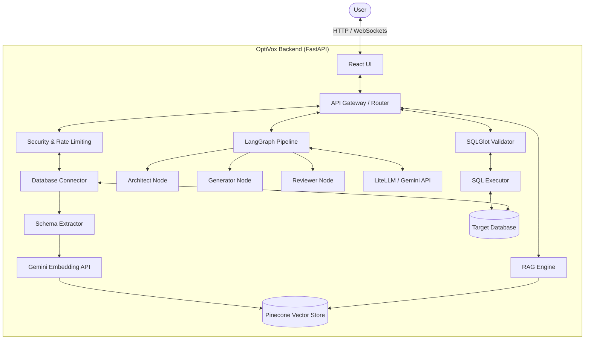

<div align="center">
  

  # OptiVox DB — Agentic AI SQL Studio

  **Transforming Database Interactions with LangGraph, LiteLLM, Pinecone, and Gemini Embeddings**

  [](#)
  [](#)
  [](#)
  [](#)
  [](#)

  <p>
    An intelligent, autonomous platform that translates natural language to executable SQL, provides deep schema analysis, teaches database concepts, and optimizes queries.
  </p>
</div>

---

## ✨ Key Features

- **🧠 Agentic SQL Generation (LangGraph)**: A multi-agent hierarchical pipeline (Architect → Generator → Reviewer) autonomously drafts, refines, and validates complex SQL queries from natural language.
- **📚 RAG Schema Search (Pinecone + Gemini Embeddings)**: Automatically extracts your database schema, generates embeddings using `gemini-embedding-001` via the Gemini API, and injects relevant context into the LLM prompt for highly accurate, hallucination-free SQL.
- **🛠️ ADIA (Agentic Database Intelligent Assistant)**:
  - **Natural Language to SQL**: Converts plain-English questions to database-specific queries.
  - **Database Tutor**: Teaches database concepts dynamically with tailored examples and lessons.
  - **Query Optimizer**: Analyzes queries (and `EXPLAIN` plans) to recommend performance tweaks, index additions, and query rewrites.
  - **Schema Analyzer**: Generates foreign key maps, identifies missing indexes, spots isolated tables, and provides AI-driven DBA recommendations.
- **📊 Agentic CSV Database Engine**: Upload raw CSV files, and OptiVox will automatically parse headers, infer column types (INTEGER, REAL, DATE, TEXT), dynamically build an isolated SQLite database on the fly, and expose a live query editor!
- **💻 Interactive SQL Playground**: A dynamic workspace for executing multi-statement SQL scripts with real-time markdown-rendered results and explanations.
- **🔌 Multi-Dialect Support**: Seamlessly connects to **MySQL, PostgreSQL, and Oracle** databases using an intelligent connection string parser.
- **🔒 Production-Grade Security**: Features audit logging, robust rate limiting, SQL AST validation (via `sqlglot`) to prevent destructive queries, and comprehensive security middleware.

## 📸 UI Showcase

### Agentic CSV Database Engine

*Easily manage multiple isolated SQLite databases generated from your CSV files.*


*Write and execute SQL instantly with live schema preview and results.*

### Database Tutor & Schema Analysis

*Learn advanced concepts like JOINs through interactive, contextual examples.*


*AI-driven recommendations for indexing, isolated tables, and query optimization.*

## 🏗️ Architecture


```mermaid
graph TD
    User([User]) <--> |HTTP / WebSockets| Frontend[React UI]
    
    subgraph "OptiVox Backend (FastAPI)"
        Frontend <--> API[API Gateway / Router]
        API <--> Auth[Security & Rate Limiting]
        Auth <--> Connector[Database Connector]
        
        API <--> RAG[RAG Engine]
        Connector --> Extractor[Schema Extractor]
        Extractor --> Embed[Gemini Embedding API]
        Embed --> Pinecone[(Pinecone Vector Store)]
        RAG --> Pinecone
        
        API <--> Agents[LangGraph Pipeline]
        Agents --> Architect[Architect Node]
        Agents --> Generator[Generator Node]
        Agents --> Reviewer[Reviewer Node]
        
        Agents <--> LLM[LiteLLM / Gemini API]
        
        API <--> Validator[SQLGlot Validator]
        Validator <--> Executor[SQL Executor]
        
        Executor <--> TargetDB[(Target Database)]
        Connector <--> TargetDB
    end
```

## 🛠️ Technology Stack

### Backend
- **Framework**: FastAPI, Uvicorn
- **AI & Agents**: LangGraph, LiteLLM (Google Gemini 2.5 Flash)
- **Vector Database**: Pinecone (cloud, serverless)
- **Embeddings**: Google Gemini API (`gemini-embedding-001`, 3072 dims)
- **Database Tools**: SQLAlchemy, PyMySQL, Psycopg2, OracleDB
- **Validation**: SQLGlot (AST parsing & safety checks)
- **Caching & State**: Cachetools, ThreadPoolExecutor

### Frontend
- **Framework**: React 19, Vite
- **Styling**: Vanilla CSS (Custom Design System with Glassmorphism)
- **Icons**: Lucide React
- **Markdown & Code**: React-Markdown, Remark-GFM
- **HTTP Client**: Axios

---

## 🚀 Getting Started

### Prerequisites
- Python 3.11+
- Node.js 18+ and npm/yarn
- A valid Google Gemini API Key
- Access to a target database (MySQL, PostgreSQL, or Oracle)

### 1. Clone the Repository
```bash
git clone https://github.com/KishoreRam-M/Optivox-v1.git
cd Optivox-v1
```

### 2. Backend Setup
Create a virtual environment and install dependencies:
```bash
python -m venv .venv
source .venv/bin/activate  # On Windows use: .venv\Scripts\activate
pip install uv
uv sync # Or pip install -r requirements.txt
```

Configure your environment variables:
Create a `.env` file in the root directory (you can copy `.env.example`):
```env
GEMINI_API_KEY=your_gemini_api_key_here
PINECONE_API_KEY=your_pinecone_api_key_here
PINECONE_INDEX_NAME=optivox-rag   # optional, this is the default
```

Start the FastAPI server:
```bash
fastapi dev app/main.py
# Or run with uvicorn: uvicorn app.main:app --reload --port 8000
```

### 3. Frontend Setup
Open a new terminal and navigate to the frontend directory:
```bash
cd frontend
npm install
npm run dev
```

Visit `http://localhost:5173` in your browser to access the OptiVox studio.

---

## ☁️ Deployment

For production, it is highly recommended to use a **split deployment** to ensure the backend has a persistent disk for SQLite (CSV feature) and LanceDB vector files.

### 1. Backend (Render / Railway)
1. Create a new Web Service on [Render](https://render.com/).
2. Connect your backend repository.
3. Use the following settings:
   - **Build Command**: `pip install -r requirements.txt`
   - **Start Command**: `uvicorn app.main:app --host 0.0.0.0 --port $PORT`
4. Add environment variables (`GEMINI_API_KEY`, etc.).

### 2. Frontend (Vercel)
1. Create a new project on [Vercel](https://vercel.com/).
2. Connect your frontend repository and select **Vite** as the framework.
3. Add an environment variable:
   - `VITE_API_BASE_URL`: The URL of your deployed backend (e.g., `https://optivox-backend.onrender.com/api`).
4. Deploy!

> **Note:** The backend no longer requires a persistent disk volume. Pinecone is fully cloud-hosted, so any serverless or ephemeral deployment (Render free tier, Railway, etc.) works without extra storage configuration.

---

## 📂 Project Structure

```text
Optivox-v1/
├── app/                 # Backend Application
│   ├── agents/          # CrewAI agents and tools
│   ├── api/             # FastAPI routers and endpoints
│   ├── audit/           # Audit logging and SQLite db setup
│   ├── database/        # Connection management & schema extraction
│   ├── models/          # Pydantic data models
│   ├── rag/             # LanceDB embedding, vector search, drift detection
│   ├── security/        # API key management and secrets
│   ├── tools/           # SQL AST parser and validation utilities
│   └── main.py          # Application entry point
├── frontend/            # React Frontend Application
│   ├── src/             # React components, contexts, and hooks
│   ├── index.html       # HTML entry point
│   ├── package.json     # Node dependencies
│   └── vite.config.js   # Vite configuration
├── csv_databases/       # SQLite databases generated from CSVs
├── lancedb_data/        # LanceDB vector data storage
├── pyproject.toml       # Python dependencies and metadata
├── requirements.txt     # Python dependencies list
└── ...
```

---

## 🛡️ Security & Auditing

OptiVox takes database security seriously:
- **Destructive Query Prevention**: `sqlglot` parses every query AST to intercept `DROP`, `DELETE`, `TRUNCATE`, and `ALTER` commands unless explicitly authorized.
- **Audit Logging**: All queries (especially DML/DDL) are logged locally to `audit.db` with IP, session, and execution metadata.
- **Rate Limiting**: IP-based rate limiting prevents API abuse.
- **Security Headers**: Hardened HTTP responses with anti-XSS, anti-sniffing, and HSTS headers.

---

## 🤝 Contributing

Contributions are welcome! If you'd like to improve OptiVox, please:
1. Fork the repository.
2. Create a feature branch (`git checkout -b feature/amazing-feature`).
3. Commit your changes (`git commit -m 'Add amazing feature'`).
4. Push to the branch (`git push origin feature/amazing-feature`).
5. Open a Pull Request.

---

## 📄 License

This project is licensed under the MIT License - see the LICENSE file for details.

---
<div align="center">
  <p>Built with ❤️ by the OptiVox Team.</p>
</div>
